## Quick Start Guide to React in 10 Minutes - 10分钟快速入门React

今天我们来讲一个超级热门的前端`js`框架`React`，你也许没有用过它，但一定听过他的名字，现在绝大多数的`Web`应用，包括很多前端的开源库都是使用`React`开发的，它最大的优点呢自然是简单和高效，这单包括它的性能，还有开发效率，尤其配合上`next.js`，`Gatsby`，`Blitz`这类框架，可以让你在很短时间内快速搭建一个相对复杂的应用。

 今天呢我给大家快速入门`React`，并向大家讲解`React`中的核心概念和一般开发流程，最后我们用它来举例搭建一个非常简单的应用。

考虑到 `React` 新版本中加入了一些新特性，比如`hooks`允许我们使用更简洁的语法来定义组件，我们就不再介绍传统的类的定方式了，另外`React`中的核心概念其实并不多，我会尽量通过实际案例将他们完整的呈现给大家，细致末节的部分可能就一笔带过了。

 在使用react之前，我们需要确保计算机中安装有`node.js`运行环境，所有打开命令行，我们可以使用`npx create-react-app`，后面跟上应用的名称来快速创建一个`React`应用。

### 创建项目

* 创建项目命令

```shell
npx create-react-app hello-react
```

* 日志

```shell
D:\04_GitHub\react-in-10-minutes>npx create-react-app hello-react

Creating a new React app in D:\04_GitHub\react-in-10-minutes\hello-react.

Installing packages. This might take a couple of minutes.
Installing react, react-dom, and react-scripts with cra-template...


added 1315 packages in 54s

252 packages are looking for funding
  run `npm fund` for details

Installing template dependencies using npm...
npm ERR! code ERESOLVE
npm ERR! ERESOLVE unable to resolve dependency tree
npm ERR!
npm ERR! While resolving: hello-react@0.1.0
npm ERR! Found: react@19.0.0
npm ERR! node_modules/react
npm ERR!   react@"^19.0.0" from the root project
npm ERR!
npm ERR! Could not resolve dependency:
npm ERR! peer react@"^18.0.0" from @testing-library/react@13.4.0
npm ERR! node_modules/@testing-library/react
npm ERR!   @testing-library/react@"^13.0.0" from the root project
npm ERR!
npm ERR! Fix the upstream dependency conflict, or retry
npm ERR! this command with --force or --legacy-peer-deps
npm ERR! to accept an incorrect (and potentially broken) dependency resolution.
npm ERR!
npm ERR!
npm ERR! For a full report see:
npm ERR! C:\Users\CoderDream\AppData\Local\npm-cache\_logs\2024-12-11T02_25_24_526Z-eresolve-report.txt

npm ERR! A complete log of this run can be found in: C:\Users\CoderDream\AppData\Local\npm-cache\_logs\2024-12-11T02_25_24_526Z-debug-0.log
`npm install --no-audit --save @testing-library/jest-dom@^5.14.1 @testing-library/react@^13.0.0 @testing-library/user-event@^13.2.1 web-vitals@^2.1.0` failed

D:\04_GitHub\react-in-10-minutes>
```

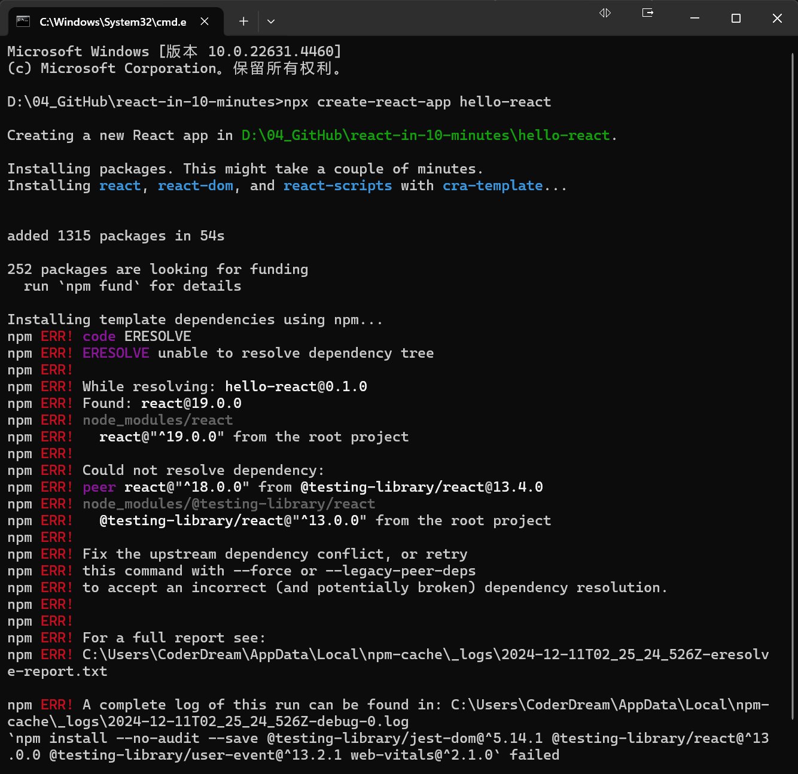

### 处理编译错误

```
cd hello-react
npm install react@^18.2.0 react-dom@^18.2.0 web-vitals
```


```shell
D:\04_GitHub\react-in-10-minutes>cd hello-react

D:\04_GitHub\react-in-10-minutes\hello-react>npm install react@^18.2.0 react-dom@^18.2.0 web-vitals

added 1 package, and changed 4 packages in 5s

252 packages are looking for funding
  run `npm fund` for details

D:\04_GitHub\react-in-10-minutes\hello-react>
```


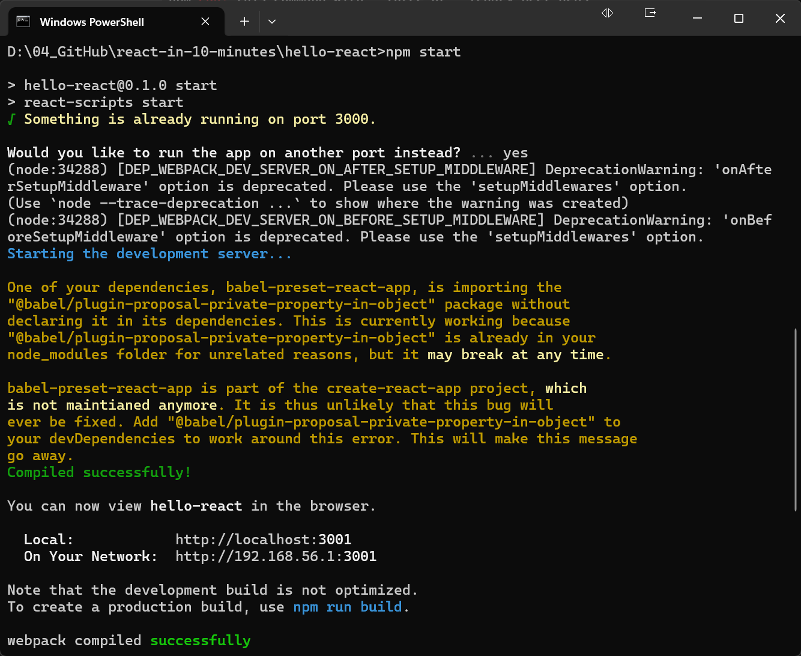

用和一般的`node`程序类似，`npm start`可以启动一个本地调试的服务器，它会自动在浏览器中打开，我们的应用。

 首先呢我们来快速浏览一下`React`工程的结构，可以看到这里全是自动生成的，代码文件比较多，不过大多数我们可以暂时忽略。

 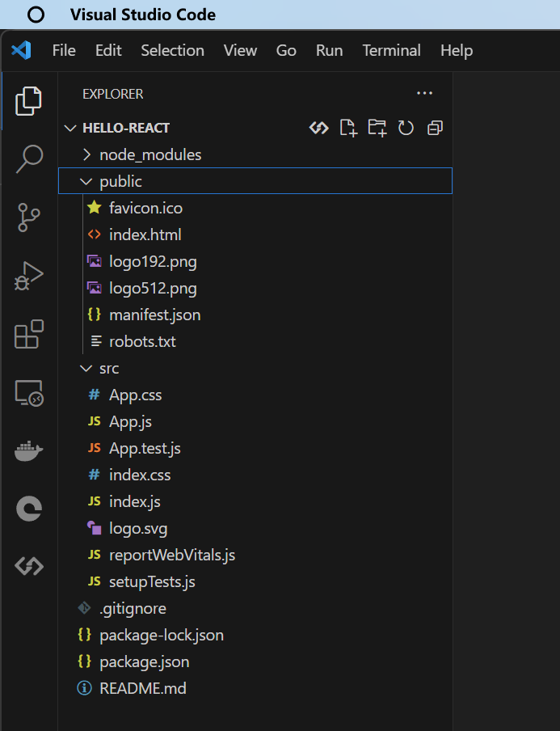

首先我们打开`source`路径下的`index.js`文件，也就是我们应用的主程序。

```jsx
import React from 'react';
import ReactDOM from 'react-dom/client';
import './index.css';
import App from './App';
import reportWebVitals from './reportWebVitals';

const root = ReactDOM.createRoot(document.getElementById('root'));
root.render(
  <React.StrictMode>
    <App />
  </React.StrictMode>
);

// If you want to start measuring performance in your app, pass a function
// to log results (for example: reportWebVitals(console.log))
// or send to an analytics endpoint. Learn more: https://bit.ly/CRA-vitals
reportWebVitals();
```

这里最最重要的是这个`ReactDom.render()`函数，整个页面的渲染都是从这里开始的，第一个参数是我们要渲染的所有元素，可以看到这里是`html`的语法，第二个参数代表将渲染的结果插入到页面的哪一个容器中，可以看到这里对应的是这个`id`叫`root`的元素。

上面是代码是新版，下面截图是旧版：

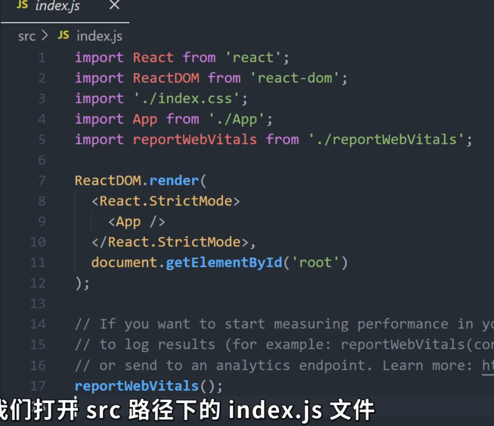

这里的第一个参数乍看之下表诡异，因为我们在`javascript`代码中嵌入了`html`标签，这个其实是`React`对js的一种语法扩展，也被叫做 `jsx`，它允许将html标签和js代码混合使用，它的优点是我们不再需要分开定义`html`和`js`文件，因此编写和阅读代码会方便很多。

```jsx
const root = ReactDOM.createRoot(document.getElementById('root'));
root.render(
  // <React.StrictMode>
  //   <App />
  // </React.StrictMode>
  <h1>Hello, React18!</h1>
);
```

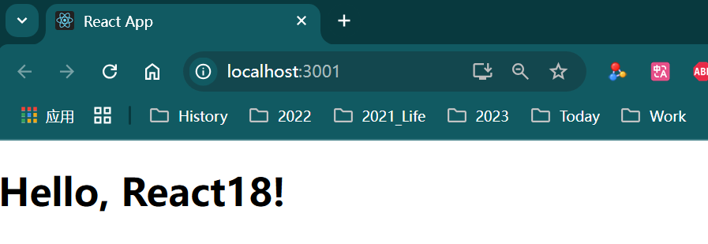

我们可以尝试去修改这里的标签，可以看到浏览器中的内容也会自动刷新。

我们继续回到之前的代码，可以看到这里的`App`显然不是一个标准的`html`标签，如果我按住`ctrl`跟随进去，它会跳到另一个函数的定义：

```jsx
import logo from './logo.svg';
import './App.css';

function App() {
  return (
    <div className="App">
      <header className="App-header">
        
        <p>
          Edit <code>src/App.js</code> and save to reload.
        </p>
        <a
          className="App-link"
          href="https://reactjs.org"
          target="_blank"
          rel="noopener noreferrer"
        >
          Learn React
        </a>
      </header>
    </div>
  );
}

export default App;
```

这里是一个非常重要的概念，`React`中的组件都可以被简化成一个函数的定义，函数的输出是一串`html`标签，也就是组件最终渲染的结果。

我们可以通过组合其他的组件或者`html`标签来创建更多复杂的组件，但这里的例子过分简单化了，因为我们的渲染结果是固定的，并且没有任何动态的逻辑。

这里我先删除掉暂时不用的代码，仅仅保留最核心的部分，`ReactDom.render()`函数和这里唯一的组件`App`。

### 极简index.js

```jsx
import React from 'react';
import ReactDOM from 'react-dom/client';

function App() {
  return <></>;
}

const root = ReactDOM.createRoot(document.getElementById('root'));
root.render(
    <App />
);
```


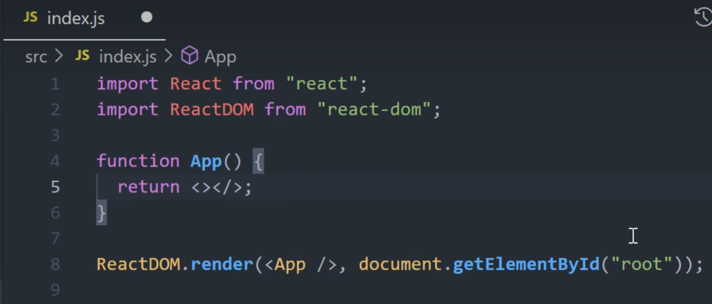

### 应用场景

接着我们来介绍一个最常见的场景，根据数据来动态生成用户界面。

数据通常是通过`api`从后端获取，不过这里为了简单起见，我在文件开头定了一个用于返回假数据的函数，`fetchTodos()`，所以在生成界面的时候，我们可以调用这个函数获取数据，并通过`map`遍历`todo`中的每一条数据，然后生成一个个列表元素，这里需要特别注意的是花括号的用法，如果我们想在`html`标签中嵌入`javascript`的表达式，则需要将它们嵌套在花括号中，这里生成的每个列表元素由复选框`input`和一个标签`label`组成，复选框是否选中，取决于数据中的`completed`属性，而标签的文本则是来自于数据中的`title`属性。

* index.js

```jsx
import React from 'react';
import ReactDOM from 'react-dom/client';

function fetchTodos() {
  return [{ id: 1, title: "吃饭", completed: false },
  { id: 2, title: "刷牙", completed: false },
  { id: 3, title: "喝水", completed: true },
  { id: 4, title: "洗澡", completed: false },
  { id: 5, title: "睡觉", completed: true }];
}

function App() {
  const todos = fetchTodos();

  return <>
  <ul>{
    todos.map(todo => (<li>
      <input type='checkbox' defaultChecked={todo.completed} />
      <label>{todo.title}</label>
      </li>))
  }</ul></>;
}

const root = ReactDOM.createRoot(document.getElementById('root'));
root.render(
  <App />
);
```

* 效果

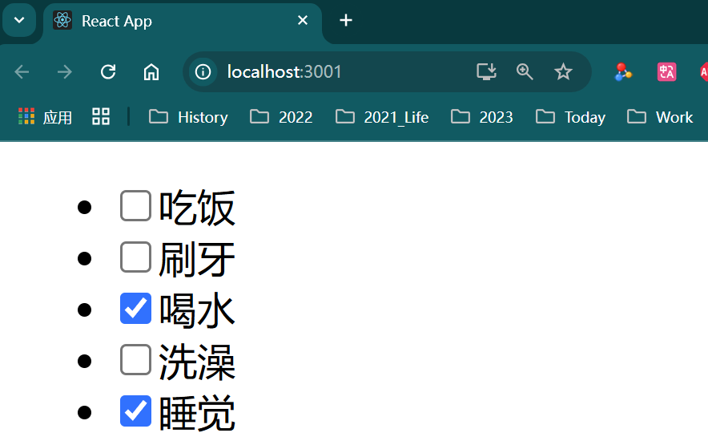

到目前为止呢，我们的界面看起来依然十分单调，我们知道`React`的一大优势在它巨大的生态系统和开源库，比如常见的ui框架`bootstrap`，`semantic`，`material ui`等等，在`React`中都有很好的继承，这里我直接使用`react-bootstrap`来对界面做一些美化，首先我们按照文档中的步骤来安装`react-bootstrap`这个包。

> 官网地址：https://react-bootstrap.github.io/docs/getting-started/introduction/

```shell
npm install react-bootstrap bootstrap@5.1.3
npm install react-bootstrap bootstrap
```


```shell
PS D:\04_GitHub\react-in-10-minutes\hello-react> npm install react-bootstrap bootstrap

added 23 packages in 6s

254 packages are looking for funding
  run `npm fund` for details
PS D:\04_GitHub\react-in-10-minutes\hello-react>
```

然后在文件开头导入我们要用到的组件和样式表。

```jsx
import "bootstrap/dist/css/bootstrap.min.css";
import { Button, Navbar,Modal } from "react-bootstrap";
import {CardChecklist,Trash} from 'react-bootstrap-icons';
import  Container  from 'react-bootstrap/Container';
import  FormControl from 'react-bootstrap/FormControl';
import InputGroup from 'react-bootstrap/InputGroup';
```

接着我们替换掉之前的`html`标签，按照文档中的用法来加入复选框和文字组件

> 官网地址：https://react-bootstrap.github.io/docs/forms/input-group/#checkboxes-and-radios

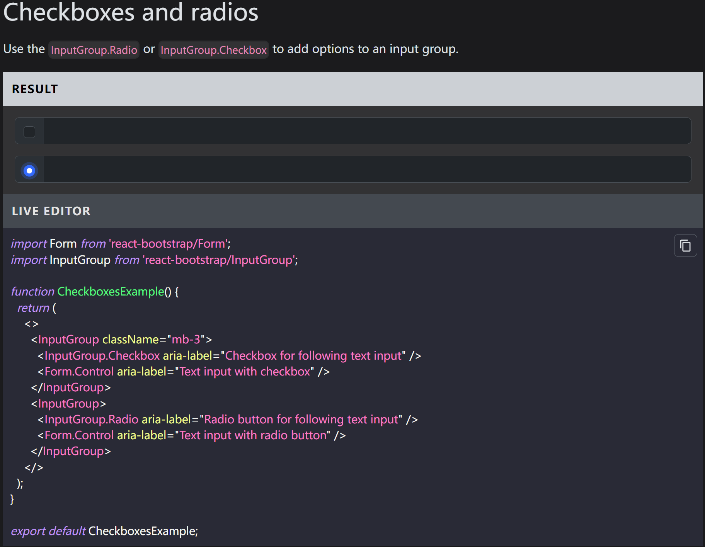

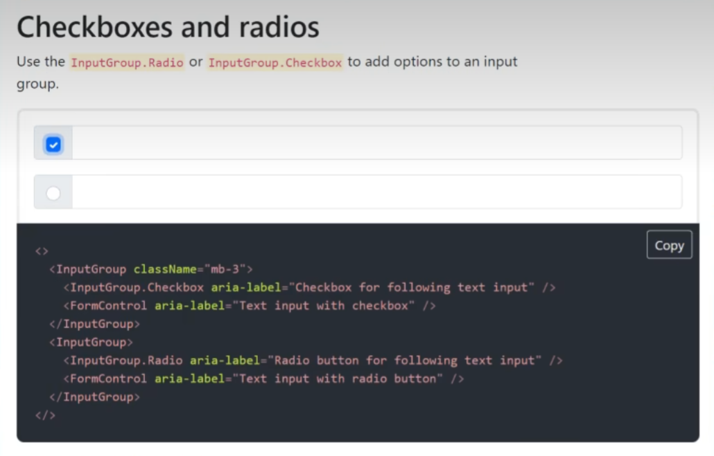

### 报错信息处理

```shell
Module not found: Error: Can't resolve 'react-bootstrap-icons' in 'D:\04_GitHub\react-in-10-minutes\hello-react\src'
```

安装缺失的包：

```shell
npm install react-bootstrap-icons
```

另外文字的部分我们会根据`completed`是否为`true`来加入一条删除线的效果，这里是修改之后的结果。

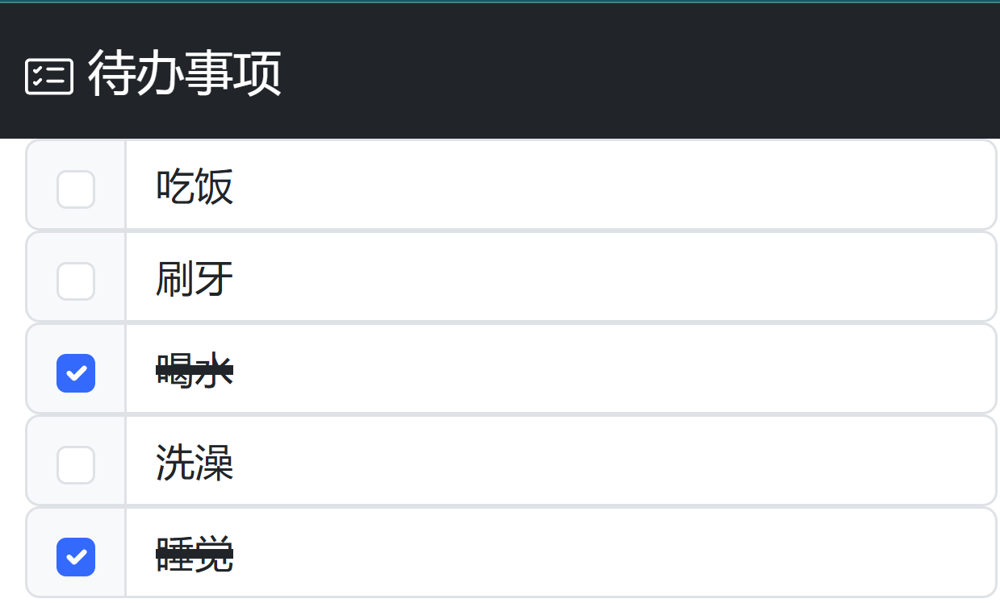

完整代码

```jsx
import "bootstrap/dist/css/bootstrap.min.css";
import React from 'react';
import ReactDOM from 'react-dom/client';
import { Button, Navbar, Modal } from "react-bootstrap";
import { CardChecklist, Trash } from 'react-bootstrap-icons';
import Container from 'react-bootstrap/Container';
import FormControl from 'react-bootstrap/FormControl';
import InputGroup from 'react-bootstrap/InputGroup';

function fetchTodos() {
  return [{ id: 1, title: "吃饭", completed: false },
  { id: 2, title: "刷牙", completed: false },
  { id: 3, title: "喝水", completed: true },
  { id: 4, title: "洗澡", completed: false },
  { id: 5, title: "睡觉", completed: true }];
}

function App() {
  const todos = fetchTodos();

  return <>
    <Navbar bg="dark" variant="dark">
      <Container>
        <Navbar.Brand href="#home">
          <CardChecklist /> 待办事项
        </Navbar.Brand>
      </Container>
    
    </Navbar>

    <Container>
      {
        todos.map(todo => (<InputGroup key={todo.id}>
          <InputGroup.Checkbox checked={todo.completed} />
          <FormControl value={todo.title}
            style={{
              textDecoration: todo.completed ? 'line-through 4px' : 'none'
            }}
          />
        </InputGroup>))
      }
    </Container>
  </>;
}

const root = ReactDOM.createRoot(document.getElementById('root'));
root.render(
  <App />
);
```

可以看到用`React`创建  一个漂亮的界面，其实非常的容易。

目前我们的界面还非常简单，假设我们之后加入了更多的代码，当组件变得更加复杂以后，我们可以考虑将其中可以重用的代码拆分成一个个独立的组件，也就是模块化，比如这里的列表元素可以被抽离成一个单独的组件，我们叫它 `TodoItem`，列表中的文字和复选框状态，我们可以用类似于`html`标签属性的语法，并作为函数参数props传递进来，随后我们可以通过`props.title`，`props.completed`来访问他们，这里的`props`在`React`中也被叫做属性，首先属性一定是由上层元素自上而下传递下来的，其次属性是只读的，换句话说，我不能在函数内部修改它们，一个组件的属性会直接决定它的输出，也就是我们最终渲染的结果。

```jsx
import "bootstrap/dist/css/bootstrap.min.css";
import React from 'react';
import ReactDOM from 'react-dom/client';
import { Button, Navbar, Modal } from "react-bootstrap";
import { CardChecklist, Trash } from 'react-bootstrap-icons';
import Container from 'react-bootstrap/Container';
import FormControl from 'react-bootstrap/FormControl';
import InputGroup from 'react-bootstrap/InputGroup';

function fetchTodos() {
  return [{ id: 1, title: "吃饭", completed: false },
  { id: 2, title: "刷牙", completed: false },
  { id: 3, title: "喝水", completed: true },
  { id: 4, title: "洗澡", completed: false },
  { id: 5, title: "睡觉", completed: true }];
}

function TodoItem(props) {
  return (<InputGroup key={props.id}>
    <InputGroup.Checkbox checked={props.completed} />
    <FormControl value={props.title}
      style={{
        textDecoration: props.completed ? 'line-through 4px' : 'none'
      }}
    />
  </InputGroup>);
}

function App() {
  const todos = fetchTodos();

  return <>
    <Navbar bg="dark" variant="dark">
      <Container>
        <Navbar.Brand href="#home">
          <CardChecklist /> 待办事项
        </Navbar.Brand>
      </Container>
    </Navbar>

    <Container>
      {
        todos.map((todo) => (
          <TodoItem key={todo.id} 
          title={todo.title} 
          completed={todo.completed} />
        ))
      }
    </Container>
  </>;
}

const root = ReactDOM.createRoot(document.getElementById('root'));
root.render(
  <App />
);
```

这种模式呢也是我们经常听到的单向数据流模式。


因为它从源头上避免了数据在组件之间的来回传递，因此更加利于调试和维护，之前我们讲到的属性可以在元素中传递静态的数据，但在实际使用中，肯定有数据是动态的，比如这里的待办事项列表，我们应当是允许去更新或者删除其中的条目的，因此要存储动态变化的数据，我们需要用到React中另一个重要的概念，`状态（States）`。

在React中要定一个状态，我们需要用到`useState()`方法，它会返回两个值，第一个是存储当前状态变量的`todos`，第二个是用于修改状态的方法，`setTodos()`，最后这里的参数代表状态的初始值。

需要强调的是，要修改一个状态，我们是不能够直接对这里的`todos`变量赋值的，这样是没有用的，相反我们必须调用`setTodos()`方法，那你可能会问，为什么我们不直接定一个普通变量，而是依靠`React`提供的这套机制来管理状态呢？

首先使用函数的局部变量肯定是不行的，因为他们在函数退出时就自动销毁了，如果使用全局变量的话，我们还要考虑到它和组件生命周期的同步，因此这里呢我们只需要简单记住`React`提供的这种特定的写法，具体的时间细节呢我们就不多做解释了。

有了状态之后呢，我们可以给列表的每一行加入一个删除按钮，用来删除对应的待办事项，当我们点击按钮时，可以响应 `Button` 的 `onClick()`事件，调用有属性传进来的`onDelete()`回调函数，然后我们在之前的`App`组件中来定义这个函数。

```jsx
import "bootstrap/dist/css/bootstrap.min.css";
import React from 'react';
import ReactDOM from 'react-dom/client';
import { Button, Navbar, Modal } from "react-bootstrap";
import { CardChecklist, Trash } from 'react-bootstrap-icons';
import Container from 'react-bootstrap/Container';
import FormControl from 'react-bootstrap/FormControl';
import InputGroup from 'react-bootstrap/InputGroup';

function fetchTodos() {
  return [{ id: 1, title: "吃饭", completed: false },
  { id: 2, title: "刷牙", completed: false },
  { id: 3, title: "喝水", completed: true },
  { id: 4, title: "洗澡", completed: false },
  { id: 5, title: "睡觉", completed: true }];
}

function TodoItem(props) {
  return (<InputGroup key={props.id}>
    <InputGroup.Checkbox checked={props.completed} />
    <FormControl value={props.title}
      style={{
        textDecoration: props.completed ? 'line-through 4px' : 'none'
      }}
    />
    <Button variant="outline-danger" onClick={props.onDelete}>
      <Trash />
    </Button>
  </InputGroup>);
}

function App() {
  // const todos = fetchTodos();
  const [todos, setTodos] = React.useState(fetchTodos());

  return <>
    <Navbar bg="dark" variant="dark">
      <Container>
        <Navbar.Brand href="#home">
          <CardChecklist /> 待办事项
        </Navbar.Brand>
      </Container>
    </Navbar>

    <Container>
      {
        todos.map((todo) => (
          <TodoItem key={todo.id} 
          title={todo.title} 
          completed={todo.completed}
          onDelete={() => {
            setTodos(todos.filter((t) => t.id !== todo.id));
          }}
          />
        ))
      }
    </Container>
  </>;
}

const root = ReactDOM.createRoot(document.getElementById('root'));
root.render(
  <App />
);
```

首先我们挑选出删除之后剩下的列表选项，然后调用`setTodos`来更新当前的状态，修改程序之后点击删出来，你会看到这样的效果。

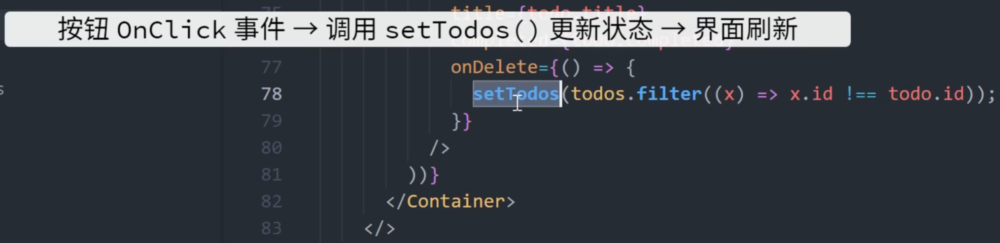

整个过程大概是当我们点击按钮之后，状态被更新之后，界面会随着状态的变化而重新渲染。

随后我们可以用同样的方法来响应复选框被按下的事件`onChange`，它会调用由属性传递进来的`onToggle`回调函数，然后我们在之前的`app`组件中来定义这方通过函数即可，当复选框被选中或者取消选中时，我们会去修改对应元素的`completed`属性，最后调用`setTodo()`来更新当前的状态，在我们点击复选框之后，会立刻切换当前待办事项的完成状态。

### 最终效果

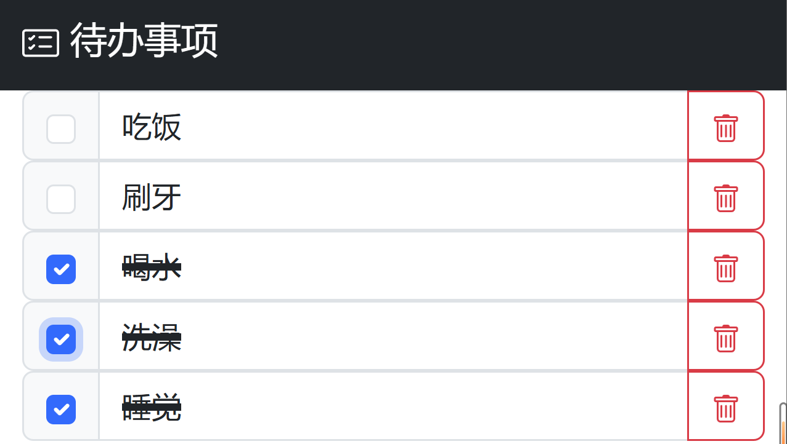

通过这个例子呢，我们就讲完了`React`中最核心的这几个概念。

```jsx
import "bootstrap/dist/css/bootstrap.min.css";
import React from 'react';
import ReactDOM from 'react-dom/client';
import { Button, Navbar, Modal } from "react-bootstrap";
import { CardChecklist, Trash } from 'react-bootstrap-icons';
import Container from 'react-bootstrap/Container';
import FormControl from 'react-bootstrap/FormControl';
import InputGroup from 'react-bootstrap/InputGroup';

function fetchTodos() {
  return [{ id: 1, title: "吃饭", completed: false },
  { id: 2, title: "刷牙", completed: false },
  { id: 3, title: "喝水", completed: true },
  { id: 4, title: "洗澡", completed: false },
  { id: 5, title: "睡觉", completed: true }];
}

function TodoItem(props) {
  return (<InputGroup key={props.id}>
    <InputGroup.Checkbox
      checked={props.completed}
      onChange={props.onToggle}
    />
    <FormControl value={props.title}
      style={{
        textDecoration: props.completed ? 'line-through 4px' : 'none'
      }}
    />
    <Button variant="outline-danger" onClick={props.onDelete}>
      <Trash />
    </Button>
  </InputGroup>);
}

function App() {
  // const todos = fetchTodos();
  const [todos, setTodos] = React.useState(fetchTodos());

  return <>
    <Navbar bg="dark" variant="dark">
      <Container>
        <Navbar.Brand href="#home">
          <CardChecklist /> 待办事项
        </Navbar.Brand>
      </Container>
    </Navbar>

    <Container>
      {
        todos.map((todo) => (
          <TodoItem key={todo.id}
            title={todo.title}
            completed={todo.completed}
            onDelete={() => {
              setTodos(todos.filter((t) => t.id !== todo.id));
            }}
            onToggle={() => {
              setTodos(todos.map((t) =>
                t.id === todo.id ? { ...todo, completed: !todo.completed } : t
              )
              );
            }}
          />
        ))
      }
    </Container>
  </>;
}

const root = ReactDOM.createRoot(document.getElementById('root'));
root.render(
  <App />
);
```


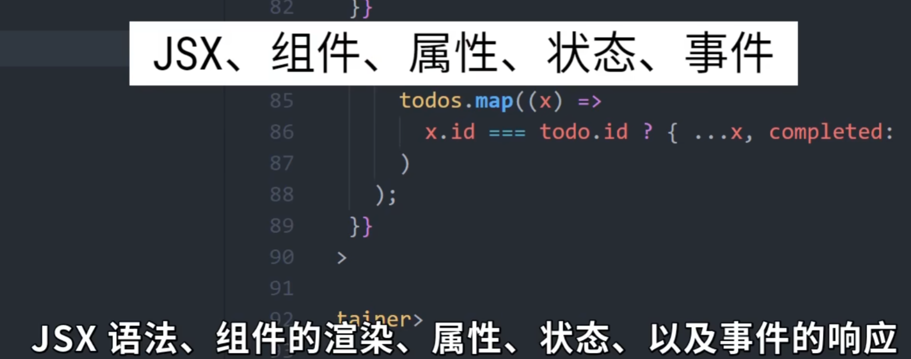

`jsx`语法、组件的渲染、属性和状态以及事件的响应，当然`React`的强大之处肯定不单单在于这个库本身，而是他背后庞大的生态链和数不胜数的开源库。要配置路由，我们有`react router`要创建动画，我们有`spring`，`frame-motion`，要管理状态，我们有`Redux`，`Flex`，`MobX`，`Recoil`，要进服务端渲染，我们有`Next.js`，`Gatsby`等等。

这里特别值得一提的是，`next.js`，你可以把它当做是一个`js`的全栈框架，它支持`api`路由服端渲染，前端的`React`组件的呢几乎是零配置使用，比如我自己就用它搭建了一个小工具来管理本地的视频素材，开发效率非常之高。

### 视频地址

React Reactjs 10分钟快速入门

https://www.bilibili.com/video/BV1ZL4y1p7Ds/

奇乐编程学院 2021-11-28 16:08:07

### 进阶版


```jsx
// 引入 Bootstrap 的样式文件
import "bootstrap/dist/css/bootstrap.min.css";
// 引入 React 核心功能及相关钩子
import React, { useState, useEffect, useRef } from 'react';
// 引入 React Bootstrap 组件和图标
import { Button, Navbar, Modal } from "react-bootstrap";
import { CardChecklist, Trash } from 'react-bootstrap-icons';
import Container from 'react-bootstrap/Container';
import FormControl from 'react-bootstrap/FormControl';
import InputGroup from 'react-bootstrap/InputGroup';
// 引入 React DOM 用于渲染组件
import ReactDOM from 'react-dom';

// 使用浏览器的 localStorage 存储数据
const storage = window.localStorage;

/**
 * 自定义 Hook：useCallbackState
 * - 用于设置带回调功能的状态
 * @param {any} od - 初始状态值
 * @returns [state, setStateWithCallback] - 状态值和支持回调的设置函数
 */
function useCallbackState(od) {
  const cbRef = useRef(); // 存储回调函数的引用
  const [data, setData] = useState(od); // 定义状态

  useEffect(() => {
    // 状态更新后执行回调函数
    cbRef.current && cbRef.current(data);
  }, [data]);

  return [data, function (d, callback) {
    cbRef.current = callback; // 更新回调函数引用
    setData(d); // 更新状态
  }];
}

/**
 * 从 localStorage 中获取待办事项
 * - 如果没有存储数据，则返回默认值
 * @returns {Array} 待办事项数组
 */
function fetchTodos() {
  let todoTasks = storage.getItem("todoTasks");
  if (eval(todoTasks)) {
    // 解析存储的 JSON 数据
    todoTasks = JSON.parse(todoTasks);
    return todoTasks;
  }
  // 返回默认任务
  return [
    {
      id: 1,
      title: "Hey, 这是一个用于追踪计划完成明细的清单,你可以点击下面的按钮,试着添加独属于你的计划任务",
      completed: false,
    }
  ];
}

/**
 * 主应用组件
 */
function App() {
  // 使用自定义 Hook 管理待办事项状态
  const [todos, setTodos] = useCallbackState(fetchTodos());
  // 控制添加待办事项的模态框显示状态
  const [show, setShow] = useState(false);
  const handleClose = () => setShow(false); // 关闭模态框
  const handleShow = () => setShow(true);  // 显示模态框

  /**
   * 添加新待办事项
   */
  const handleAddItem = () => {
    let todo = {};
    todo.id = guid(); // 生成唯一 ID
    todo.title = document.getElementById("todoItem").value; // 获取输入内容
    todo.completed = document.getElementById("ifCompleted").checked; // 是否已完成
    todos.push(todo); // 添加到待办事项数组
    setTodos(todos); // 更新状态
    setShow(false); // 关闭模态框
    save(todos); // 保存到 localStorage
  };

  return (
    <>
      {/* 导航栏 */}
      <Navbar bg="dark" variant="dark">
        <Container>
          <Navbar.Brand href="#home">
            <CardChecklist /> 待办清单
          </Navbar.Brand>
        </Container>
      </Navbar>

      {/* 待办事项列表 */}
      <Container>
        {todos.map((todo) => (
          <TodoItem
            key={todo.id}
            title={todo.title}
            completed={todo.completed}
            onDelete={() => {
              // 删除待办事项
              setTodos(todos.filter((x) => x.id !== todo.id), function (todos) {
                save(todos);
              });
            }}
            onToggle={() => {
              // 切换完成状态
              setTodos(
                todos.map((x) =>
                  x.id === todo.id ? { ...x, completed: !x.completed } : x
                ),
                function (todos) {
                  save(todos);
                }
              );
            }}
            onEdit={(event) => {
              // 编辑待办事项标题
              setTodos(
                todos.map((x) =>
                  x.id === todo.id ? { ...x, title: event.target.value } : x
                ),
                function (todos) {
                  save(todos);
                }
              );
            }}
          />
        ))}
        {/* 新增待办按钮 */}
        <div className="d-grid gap-2">
          <Button variant="primary" size="lg" onClick={handleShow}>
            新增待办
          </Button>
        </div>
      </Container>

      {/* 新增待办模态框 */}
      <Modal show={show} onHide={handleClose}>
        <Modal.Header closeButton>
          <Modal.Title>添加待办事项</Modal.Title>
        </Modal.Header>
        <Modal.Body>
          <InputGroup className="mb-3">
            <InputGroup.Checkbox aria-label="是否已完成" id="ifCompleted" />
            <FormControl
              aria-label="输入待办事项"
              id="todoItem"
              placeholder="输入待办任务,勾选左侧代表已完成"
            />
          </InputGroup>
        </Modal.Body>
        <Modal.Footer>
          <Button variant="secondary" onClick={handleClose}>
            取消
          </Button>
          <Button variant="primary" onClick={handleAddItem}>
            保存
          </Button>
        </Modal.Footer>
      </Modal>
    </>
  );

  /**
   * 保存待办事项到 localStorage
   * @param {Array} todos - 待办事项数组
   */
  function save(todos) {
    storage.setItem("todoTasks", JSON.stringify(todos));
  }

  /**
   * 单个待办事项组件
   * @param {Object} props - 待办事项属性
   */
  function TodoItem(props) {
    return (
      <InputGroup key={props.id}>
        <InputGroup.Checkbox
          checked={props.completed}
          onChange={props.onToggle}
        />
        <FormControl
          defaultValue={props.title}
          onBlur={props.onEdit}
          style={{
            textDecoration: props.completed ? "line-through 4px" : "none",
          }}
        />
        <Button variant="outline-danger" onClick={props.onDelete}>
          <Trash />
        </Button>
      </InputGroup>
    );
  }

  /**
   * 生成唯一 ID
   * @returns {string} GUID
   */
  function guid() {
    return 'xxxxxxxx-xxxx-4xxx-yxxx-xxxxxxxxxxxx'.replace(/[xy]/g, function (c) {
      var r = (Math.random() * 16) | 0,
        v = c === 'x' ? r : (r & 0x3) | 0x8;
      return v.toString(16);
    });
  }
}

// 渲染主应用到 DOM
ReactDOM.render(<App />, document.getElementById('root'));
```

### 优化版

```jsx
// 引入 Bootstrap 样式文件，用于快速设置样式
import "bootstrap/dist/css/bootstrap.min.css";
// 引入 React 核心功能及相关钩子
import React, { useState, useEffect, useRef } from 'react';
// 引入 React Bootstrap 组件和图标，用于实现 UI 组件
import { Button, Navbar, Modal } from "react-bootstrap";
import { CardChecklist, Trash } from 'react-bootstrap-icons';
import Container from 'react-bootstrap/Container';
import FormControl from 'react-bootstrap/FormControl';
import InputGroup from 'react-bootstrap/InputGroup';
// 引入 ReactDOM 用于渲染 React 组件
import ReactDOM from 'react-dom';

// 获取浏览器的 localStorage，用于持久化存储数据
const storage = window.localStorage;

/**
 * 自定义 Hook：useCallbackState
 * 用于在更新状态时支持异步回调，确保回调在状态更新后执行。
 * @param {any} initialState - 初始状态值
 * @returns {[any, function]} 状态值和更新状态的函数
 */
function useCallbackState(initialState) {
  const callbackRef = useRef(); // 存储回调函数的引用
  const [state, setState] = useState(initialState); // 定义状态

  useEffect(() => {
    // 在状态更新后调用回调函数
    if (callbackRef.current) {
      callbackRef.current(state);
    }
  }, [state]);

  // 包装的 setState 函数，支持回调
  const setStateWithCallback = (newState, callback) => {
    callbackRef.current = callback;
    setState(newState);
  };

  return [state, setStateWithCallback];
}

/**
 * 从 localStorage 获取待办事项列表
 * 如果不存在有效数据，则返回默认值。
 * @returns {Array} 待办事项列表
 */
function fetchTodos() {
  const todoTasks = storage.getItem("todoTasks");
  if (todoTasks) {
    try {
      return JSON.parse(todoTasks);
    } catch (error) {
      console.error("Failed to parse todoTasks from localStorage:", error);
    }
  }
  // 默认返回的待办事项
  return [
    {
      id: 1,
      title: "Hey, 这是一个用于追踪计划完成明细的清单，你可以点击下面的按钮，试着添加独属于你的计划任务",
      completed: false,
    },
  ];
}

/**
 * 主应用组件
 * 包括待办事项的列表显示、增删改查功能。
 */
function App() {
  // 使用自定义 Hook 管理待办事项的状态
  const [todos, setTodos] = useCallbackState(fetchTodos());
  // 控制模态框的显示状态
  const [showModal, setShowModal] = useState(false);

  // 关闭模态框
  const handleCloseModal = () => setShowModal(false);
  // 显示模态框
  const handleShowModal = () => setShowModal(true);

  /**
   * 添加新的待办事项
   */
  const handleAddItem = () => {
    const newTodo = {
      id: generateUUID(), // 生成唯一 ID
      title: document.getElementById("todoItem").value.trim(), // 获取输入框的值并去掉首尾空格
      completed: document.getElementById("ifCompleted").checked, // 获取是否完成的状态
    };

    // 校验输入，防止添加空任务
    if (!newTodo.title) {
      alert("待办事项标题不能为空！");
      return;
    }

    const updatedTodos = [...todos, newTodo]; // 使用扩展运算符生成新数组，确保状态不可变
    setTodos(updatedTodos, saveTodos); // 更新状态并保存到 localStorage
    setShowModal(false); // 关闭模态框
  };

  return (
    <>
      {/* 导航栏 */}
      <Navbar bg="dark" variant="dark">
        <Container>
          <Navbar.Brand href="#home">
            <CardChecklist /> 待办清单
          </Navbar.Brand>
        </Container>
      </Navbar>

      {/* 待办事项列表 */}
      <Container>
        {todos.map((todo) => (
          <TodoItem
            key={todo.id} // 使用唯一 ID 作为 key
            title={todo.title}
            completed={todo.completed}
            onDelete={() => {
              const filteredTodos = todos.filter((x) => x.id !== todo.id); // 过滤掉被删除的项
              setTodos(filteredTodos, saveTodos); // 更新状态并保存
            }}
            onToggle={() => {
              const toggledTodos = todos.map((x) =>
                x.id === todo.id ? { ...x, completed: !x.completed } : x
              ); // 切换完成状态
              setTodos(toggledTodos, saveTodos);
            }}
            onEdit={(event) => {
              const editedTodos = todos.map((x) =>
                x.id === todo.id ? { ...x, title: event.target.value.trim() } : x
              ); // 更新标题
              setTodos(editedTodos, saveTodos);
            }}
          />
        ))}
        <div className="d-grid gap-2">
          <Button variant="primary" size="lg" onClick={handleShowModal}>
            新增待办
          </Button>
        </div>
      </Container>

      {/* 新增待办模态框 */}
      <Modal show={showModal} onHide={handleCloseModal}>
        <Modal.Header closeButton>
          <Modal.Title>添加待办事项</Modal.Title>
        </Modal.Header>
        <Modal.Body>
          <InputGroup className="mb-3">
            <InputGroup.Checkbox aria-label="是否已完成" id="ifCompleted" />
            <FormControl
              aria-label="输入待办事项"
              id="todoItem"
              placeholder="输入待办任务，勾选左侧代表已完成"
            />
          </InputGroup>
        </Modal.Body>
        <Modal.Footer>
          <Button variant="secondary" onClick={handleCloseModal}>
            取消
          </Button>
          <Button variant="primary" onClick={handleAddItem}>
            保存
          </Button>
        </Modal.Footer>
      </Modal>
    </>
  );

  /**
   * 保存待办事项到 localStorage
   */
  function saveTodos() {
    storage.setItem("todoTasks", JSON.stringify(todos));
  }

  /**
   * 待办事项子组件
   * @param {object} props - 待办事项的属性
   */
  function TodoItem({ title, completed, onDelete, onToggle, onEdit }) {
    return (
      <InputGroup>
        <InputGroup.Checkbox checked={completed} onChange={onToggle} />
        <FormControl
          defaultValue={title}
          onBlur={onEdit}
          style={{
            textDecoration: completed ? "line-through 4px" : "none", // 已完成任务添加删除线
          }}
        />
        <Button variant="outline-danger" onClick={onDelete}>
          <Trash />
        </Button>
      </InputGroup>
    );
  }

  /**
   * 生成唯一 ID
   * 使用随机数和时间戳的组合，确保唯一性
   * @returns {string} 唯一 ID
   */
  function generateUUID() {
    return 'xxxxxxxx-xxxx-4xxx-yxxx-xxxxxxxxxxxx'.replace(/[xy]/g, (c) => {
      const r = (Math.random() * 16) | 0;
      const v = c === 'x' ? r : (r & 0x3) | 0x8;
      return v.toString(16);
    });
  }
}

// 将主应用组件渲染到 DOM 中的指定节点
ReactDOM.render(<App />, document.getElementById('root'));
```


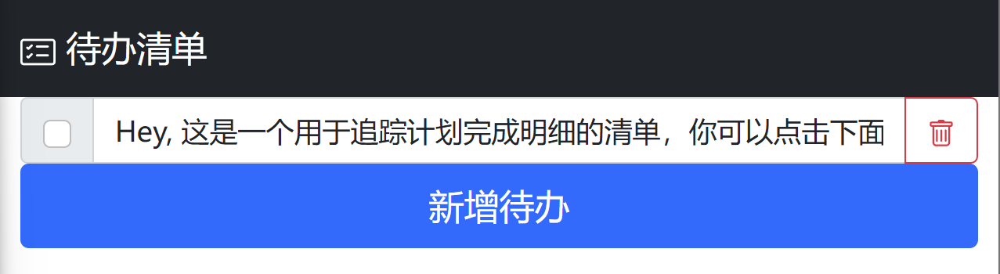


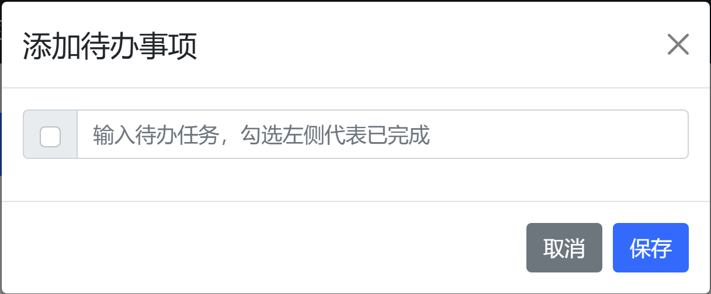


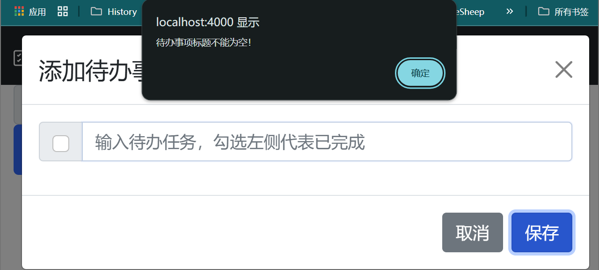


## 修改默认端口

在 React 项目中，可以通过以下几种方式修改开发服务器的默认端口（通常是 `3000`）：

---

### 方法 1: 修改 `package.json`
在 `package.json` 中的 `scripts` 部分，直接为 `start` 命令指定端口：
```json
"scripts": {
  "start": "PORT=4000 react-scripts start"
}
```
- 将 `4000` 替换为你想使用的端口号。
- 注意：在 Windows 系统中，可能需要使用 `cross-env` 工具来支持设置环境变量。

**在 Windows 系统上运行时的解决方案**：
```bash
npm install cross-env --save-dev
```
然后修改 `package.json` 的 `start` 命令为：
```json
"scripts": {
  "start": "cross-env PORT=4000 react-scripts start"
}
```

---

### 方法 2: 使用 `.env` 文件
创建一个 `.env` 文件（如果不存在），并添加以下内容：
```env
PORT=4000
```
- 这会将开发服务器的端口设置为 `4000`。
- 确保 `.env` 文件位于项目的根目录中，并且在 `.gitignore` 中已忽略。

---

### 方法 3: 命令行参数（临时修改）
在运行 `npm start` 时，可以直接在命令前指定端口：
```bash
PORT=4000 npm start
```
- 对于 Windows 系统，可能需要借助 `cross-env` 工具：
```bash
npx cross-env PORT=4000 npm start
```
- 此方法仅在当前运行命令时生效，不会永久更改项目配置。

---

### 方法 4: 使用 `webpack-dev-server` 配置
如果你使用了 `webpack-dev-server`，可以通过修改 `webpack.config.js` 中的 `devServer` 配置来更改端口：
```javascript
module.exports = {
  // 其他 webpack 配置
  devServer: {
    port: 4000, // 设置开发服务器端口
  },
};
```

---

### 方法 5: 检查端口占用问题
在某些情况下，如果你发现端口冲突问题，可以通过以下命令释放占用端口：

- **Linux/macOS**:
  ```bash
  sudo lsof -i :3000
  sudo kill -9 <PID>
  ```
- **Windows**:
  ```bash
  netstat -ano | findstr :3000
  taskkill /PID <PID> /F
  ```

---

### 总结
- **最简单的方法**：使用 `.env` 文件或在命令行指定端口。
- **适合复杂项目**：通过 `webpack-dev-server` 或修改 `package.json` 结合 `cross-env` 工具。
