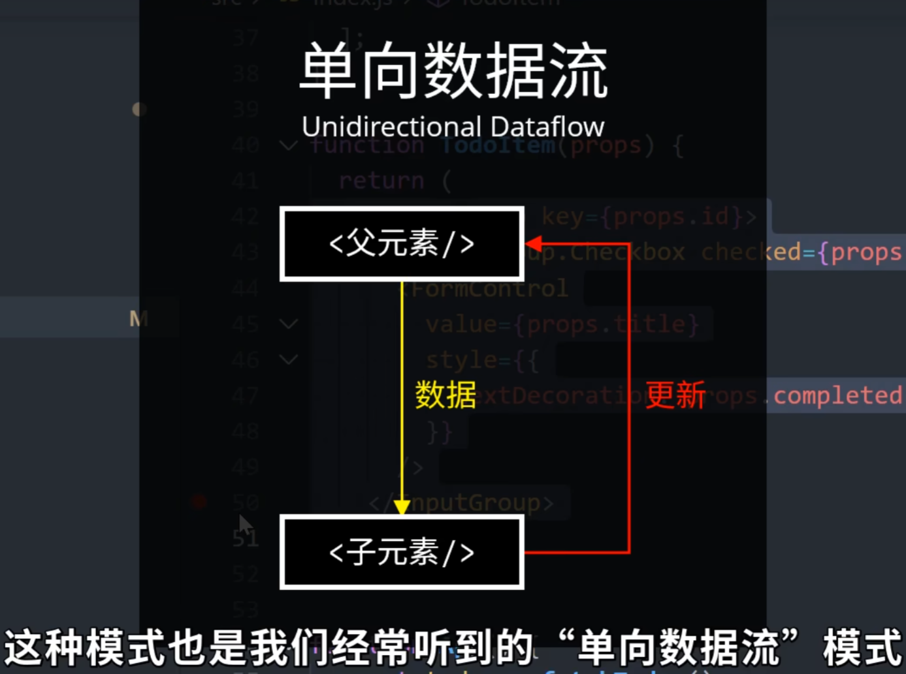

## Quick Start Guide to React in 10 Minutes - 10分钟快速入门React

今天我们来讲一个超级热门的前端`js`框架`React`，你也许没有用过它，但一定听过他的名字，现在绝大多数的`Web`应用，包括很多前端的开源库都是使用`React`开发的，它最大的优点呢自然是简单和高效，这单包括它的性能，还有开发效率，尤其配合上`next.js`，`Gatsby`，`Blitz`这类框架，可以让你在很短时间内快速搭建一个相对复杂的应用。

 今天呢我给大家快速入门`React`，并向大家讲解`React`中的核心概念和一般开发流程，最后我们用它来举例搭建一个非常简单的应用。

考虑到 `React` 新版本中加入了一些新特性，比如`hooks`允许我们使用更简洁的语法来定义组件，我们就不再介绍传统的类的定方式了，另外`React`中的核心概念其实并不多，我会尽量通过实际案例将他们完整的呈现给大家，细致末节的部分可能就一笔带过了。

 在使用react之前，我们需要确保计算机中安装有`node.js`运行环境，所有打开命令行，我们可以使用`npx create-react-app`，后面跟上应用的名称来快速创建一个`React`应用。

### 创建项目

* 创建项目命令

```shell
npx create-react-app hello-react
```

* 日志

```shell
D:\04_GitHub\react-in-10-minutes>npx create-react-app hello-react

Creating a new React app in D:\04_GitHub\react-in-10-minutes\hello-react.

Installing packages. This might take a couple of minutes.
Installing react, react-dom, and react-scripts with cra-template...


added 1315 packages in 54s

252 packages are looking for funding
  run `npm fund` for details

Installing template dependencies using npm...
npm ERR! code ERESOLVE
npm ERR! ERESOLVE unable to resolve dependency tree
npm ERR!
npm ERR! While resolving: hello-react@0.1.0
npm ERR! Found: react@19.0.0
npm ERR! node_modules/react
npm ERR!   react@"^19.0.0" from the root project
npm ERR!
npm ERR! Could not resolve dependency:
npm ERR! peer react@"^18.0.0" from @testing-library/react@13.4.0
npm ERR! node_modules/@testing-library/react
npm ERR!   @testing-library/react@"^13.0.0" from the root project
npm ERR!
npm ERR! Fix the upstream dependency conflict, or retry
npm ERR! this command with --force or --legacy-peer-deps
npm ERR! to accept an incorrect (and potentially broken) dependency resolution.
npm ERR!
npm ERR!
npm ERR! For a full report see:
npm ERR! C:\Users\CoderDream\AppData\Local\npm-cache\_logs\2024-12-11T02_25_24_526Z-eresolve-report.txt

npm ERR! A complete log of this run can be found in: C:\Users\CoderDream\AppData\Local\npm-cache\_logs\2024-12-11T02_25_24_526Z-debug-0.log
`npm install --no-audit --save @testing-library/jest-dom@^5.14.1 @testing-library/react@^13.0.0 @testing-library/user-event@^13.2.1 web-vitals@^2.1.0` failed

D:\04_GitHub\react-in-10-minutes>
```


### 处理编译错误

```
cd hello-react
npm install react@^18.2.0 react-dom@^18.2.0 web-vitals
```


```shell
D:\04_GitHub\react-in-10-minutes>cd hello-react

D:\04_GitHub\react-in-10-minutes\hello-react>npm install react@^18.2.0 react-dom@^18.2.0 web-vitals

added 1 package, and changed 4 packages in 5s

252 packages are looking for funding
  run `npm fund` for details

D:\04_GitHub\react-in-10-minutes\hello-react>
```


用和一般的`node`程序类似，`npm start`可以启动一个本地调试的服务器，它会自动在浏览器中打开，我们的应用。

 首先呢我们来快速浏览一下`React`工程的结构，可以看到这里全是自动生成的，代码文件比较多，不过大多数我们可以暂时忽略。

 

首先我们打开`source`路径下的`index.js`文件，也就是我们应用的主程序。

```jsx
import React from 'react';
import ReactDOM from 'react-dom/client';
import './index.css';
import App from './App';
import reportWebVitals from './reportWebVitals';

const root = ReactDOM.createRoot(document.getElementById('root'));
root.render(
  <React.StrictMode>
    <App />
  </React.StrictMode>
);

// If you want to start measuring performance in your app, pass a function
// to log results (for example: reportWebVitals(console.log))
// or send to an analytics endpoint. Learn more: https://bit.ly/CRA-vitals
reportWebVitals();
```

这里最最重要的是这个`ReactDom.render()`函数，整个页面的渲染都是从这里开始的，第一个参数是我们要渲染的所有元素，可以看到这里是`html`的语法，第二个参数代表将渲染的结果插入到页面的哪一个容器中，可以看到这里对应的是这个`id`叫`root`的元素。

上面是代码是新版，下面截图是旧版：


这里的第一个参数乍看之下表诡异，因为我们在`javascript`代码中嵌入了`html`标签，这个其实是`React`对js的一种语法扩展，也被叫做 `jsx`，它允许将html标签和js代码混合使用，它的优点是我们不再需要分开定义`html`和`js`文件，因此编写和阅读代码会方便很多。

```jsx
const root = ReactDOM.createRoot(document.getElementById('root'));
root.render(
  // <React.StrictMode>
  //   <App />
  // </React.StrictMode>
  <h1>Hello, React18!</h1>
);
```


我们可以尝试去修改这里的标签，可以看到浏览器中的内容也会自动刷新。

我们继续回到之前的代码，可以看到这里的`App`显然不是一个标准的`html`标签，如果我按住`ctrl`跟随进去，它会跳到另一个函数的定义：

```jsx
import logo from './logo.svg';
import './App.css';

function App() {
  return (
    <div className="App">
      <header className="App-header">
        
        <p>
          Edit <code>src/App.js</code> and save to reload.
        </p>
        <a
          className="App-link"
          href="https://reactjs.org"
          target="_blank"
          rel="noopener noreferrer"
        >
          Learn React
        </a>
      </header>
    </div>
  );
}

export default App;
```

这里是一个非常重要的概念，`React`中的组件都可以被简化成一个函数的定义，函数的输出是一串`html`标签，也就是组件最终渲染的结果。

我们可以通过组合其他的组件或者`html`标签来创建更多复杂的组件，但这里的例子过分简单化了，因为我们的渲染结果是固定的，并且没有任何动态的逻辑。

这里我先删除掉暂时不用的代码，仅仅保留最核心的部分，`ReactDom.render()`函数和这里唯一的组件`App`。

### 极简index.js

```jsx
import React from 'react';
import ReactDOM from 'react-dom/client';

function App() {
  return <></>;
}

const root = ReactDOM.createRoot(document.getElementById('root'));
root.render(
    <App />
);
```


### 应用场景

接着我们来介绍一个最常见的场景，根据数据来动态生成用户界面。

数据通常是通过`api`从后端获取，不过这里为了简单起见，我在文件开头定了一个用于返回假数据的函数，`fetchTodos()`，所以在生成界面的时候，我们可以调用这个函数获取数据，并通过`map`遍历`todo`中的每一条数据，然后生成一个个列表元素，这里需要特别注意的是花括号的用法，如果我们想在`html`标签中嵌入`javascript`的表达式，则需要将它们嵌套在花括号中，这里生成的每个列表元素由复选框`input`和一个标签`label`组成，复选框是否选中，取决于数据中的`completed`属性，而标签的文本则是来自于数据中的`title`属性。

* index.js

```jsx
import React from 'react';
import ReactDOM from 'react-dom/client';

function fetchTodos() {
  return [{ id: 1, title: "吃饭", completed: false },
  { id: 2, title: "刷牙", completed: false },
  { id: 3, title: "喝水", completed: true },
  { id: 4, title: "洗澡", completed: false },
  { id: 5, title: "睡觉", completed: true }];
}

function App() {
  const todos = fetchTodos();

  return <>
  <ul>{
    todos.map(todo => (<li>
      <input type='checkbox' defaultChecked={todo.completed} />
      <label>{todo.title}</label>
      </li>))
  }</ul></>;
}

const root = ReactDOM.createRoot(document.getElementById('root'));
root.render(
  <App />
);
```

* 效果


到目前为止呢，我们的界面看起来依然十分单调，我们知道`React`的一大优势在它巨大的生态系统和开源库，比如常见的ui框架`bootstrap`，`semantic`，`material ui`等等，在`React`中都有很好的继承，这里我直接使用`react-bootstrap`来对界面做一些美化，首先我们按照文档中的步骤来安装`react-bootstrap`这个包。

> 官网地址：https://react-bootstrap.github.io/docs/getting-started/introduction/

```shell
npm install react-bootstrap bootstrap@5.1.3
npm install react-bootstrap bootstrap
```


```shell
PS D:\04_GitHub\react-in-10-minutes\hello-react> npm install react-bootstrap bootstrap

added 23 packages in 6s

254 packages are looking for funding
  run `npm fund` for details
PS D:\04_GitHub\react-in-10-minutes\hello-react>
```

然后在文件开头导入我们要用到的组件和样式表。

```jsx
import "bootstrap/dist/css/bootstrap.min.css";
import { Button, Navbar,Modal } from "react-bootstrap";
import {CardChecklist,Trash} from 'react-bootstrap-icons';
import  Container  from 'react-bootstrap/Container';
import  FormControl from 'react-bootstrap/FormControl';
import InputGroup from 'react-bootstrap/InputGroup';
```

接着我们替换掉之前的`html`标签，按照文档中的用法来加入复选框和文字组件

> 官网地址：https://react-bootstrap.github.io/docs/forms/input-group/#checkboxes-and-radios


### 报错信息处理

```shell
Module not found: Error: Can't resolve 'react-bootstrap-icons' in 'D:\04_GitHub\react-in-10-minutes\hello-react\src'
```

安装缺失的包：

```shell
npm install react-bootstrap-icons
```

另外文字的部分我们会根据`completed`是否为`true`来加入一条删除线的效果，这里是修改之后的结果。


完整代码

```jsx
import "bootstrap/dist/css/bootstrap.min.css";
import React from 'react';
import ReactDOM from 'react-dom/client';
import { Button, Navbar, Modal } from "react-bootstrap";
import { CardChecklist, Trash } from 'react-bootstrap-icons';
import Container from 'react-bootstrap/Container';
import FormControl from 'react-bootstrap/FormControl';
import InputGroup from 'react-bootstrap/InputGroup';

function fetchTodos() {
  return [{ id: 1, title: "吃饭", completed: false },
  { id: 2, title: "刷牙", completed: false },
  { id: 3, title: "喝水", completed: true },
  { id: 4, title: "洗澡", completed: false },
  { id: 5, title: "睡觉", completed: true }];
}

function App() {
  const todos = fetchTodos();

  return <>
    <Navbar bg="dark" variant="dark">
      <Container>
        <Navbar.Brand href="#home">
          <CardChecklist /> 待办事项
        </Navbar.Brand>
      </Container>
    
    </Navbar>

    <Container>
      {
        todos.map(todo => (<InputGroup key={todo.id}>
          <InputGroup.Checkbox checked={todo.completed} />
          <FormControl value={todo.title}
            style={{
              textDecoration: todo.completed ? 'line-through 4px' : 'none'
            }}
          />
        </InputGroup>))
      }
    </Container>
  </>;
}

const root = ReactDOM.createRoot(document.getElementById('root'));
root.render(
  <App />
);
```

可以看到用`React`创建  一个漂亮的界面，其实非常的容易。

目前我们的界面还非常简单，假设我们之后加入了更多的代码，当组件变得更加复杂以后，我们可以考虑将其中可以重用的代码拆分成一个个独立的组件，也就是模块化，比如这里的列表元素可以被抽离成一个单独的组件，我们叫它 `TodoItem`，列表中的文字和复选框状态，我们可以用类似于`html`标签属性的语法，并作为函数参数props传递进来，随后我们可以通过`props.title`，`props.completed`来访问他们，这里的`props`在`React`中也被叫做属性，首先属性一定是由上层元素自上而下传递下来的，其次属性是只读的，换句话说，我不能在函数内部修改它们，一个组件的属性会直接决定它的输出，也就是我们最终渲染的结果。

```jsx
import "bootstrap/dist/css/bootstrap.min.css";
import React from 'react';
import ReactDOM from 'react-dom/client';
import { Button, Navbar, Modal } from "react-bootstrap";
import { CardChecklist, Trash } from 'react-bootstrap-icons';
import Container from 'react-bootstrap/Container';
import FormControl from 'react-bootstrap/FormControl';
import InputGroup from 'react-bootstrap/InputGroup';

function fetchTodos() {
  return [{ id: 1, title: "吃饭", completed: false },
  { id: 2, title: "刷牙", completed: false },
  { id: 3, title: "喝水", completed: true },
  { id: 4, title: "洗澡", completed: false },
  { id: 5, title: "睡觉", completed: true }];
}

function TodoItem(props) {
  return (<InputGroup key={props.id}>
    <InputGroup.Checkbox checked={props.completed} />
    <FormControl value={props.title}
      style={{
        textDecoration: props.completed ? 'line-through 4px' : 'none'
      }}
    />
  </InputGroup>);
}

function App() {
  const todos = fetchTodos();

  return <>
    <Navbar bg="dark" variant="dark">
      <Container>
        <Navbar.Brand href="#home">
          <CardChecklist /> 待办事项
        </Navbar.Brand>
      </Container>
    </Navbar>

    <Container>
      {
        todos.map((todo) => (
          <TodoItem key={todo.id} 
          title={todo.title} 
          completed={todo.completed} />
        ))
      }
    </Container>
  </>;
}

const root = ReactDOM.createRoot(document.getElementById('root'));
root.render(
  <App />
);
```

这种模式呢也是我们经常听到的单向数据流模式。



因为它从源头上避免了数据在组件之间的来回传递，因此更加利于调试和维护，之前我们讲到的属性可以在元素中传递静态的数据，但在实际使用中，肯定有数据是动态的，比如这里的待办事项列表，我们应当是允许去更新或者删除其中的条目的，因此要存储动态变化的数据，我们需要用到React中另一个重要的概念，`状态（States）`。

在React中要定一个状态，我们需要用到`useState()`方法，它会返回两个值，第一个是存储当前状态变量的`todos`，第二个是用于修改状态的方法，`setTodos()`，最后这里的参数代表状态的初始值。

需要强调的是，要修改一个状态，我们是不能够直接对这里的`todos`变量赋值的，这样是没有用的，相反我们必须调用`setTodos()`方法，那你可能会问，为什么我们不直接定一个普通变量，而是依靠`React`提供的这套机制来管理状态呢？

首先使用函数的局部变量肯定是不行的，因为他们在函数退出时就自动销毁了，如果使用全局变量的话，我们还要考虑到它和组件生命周期的同步，因此这里呢我们只需要简单记住`React`提供的这种特定的写法，具体的时间细节呢我们就不多做解释了。

有了状态之后呢，我们可以给列表的每一行加入一个删除按钮，用来删除对应的待办事项，当我们点击按钮时，可以响应 `Button` 的 `onClick()`事件，调用有属性传进来的`onDelete()`回调函数，然后我们在之前的`App`组件中来定义这个函数。

```jsx
import "bootstrap/dist/css/bootstrap.min.css";
import React from 'react';
import ReactDOM from 'react-dom/client';
import { Button, Navbar, Modal } from "react-bootstrap";
import { CardChecklist, Trash } from 'react-bootstrap-icons';
import Container from 'react-bootstrap/Container';
import FormControl from 'react-bootstrap/FormControl';
import InputGroup from 'react-bootstrap/InputGroup';

function fetchTodos() {
  return [{ id: 1, title: "吃饭", completed: false },
  { id: 2, title: "刷牙", completed: false },
  { id: 3, title: "喝水", completed: true },
  { id: 4, title: "洗澡", completed: false },
  { id: 5, title: "睡觉", completed: true }];
}

function TodoItem(props) {
  return (<InputGroup key={props.id}>
    <InputGroup.Checkbox checked={props.completed} />
    <FormControl value={props.title}
      style={{
        textDecoration: props.completed ? 'line-through 4px' : 'none'
      }}
    />
    <Button variant="outline-danger" onClick={props.onDelete}>
      <Trash />
    </Button>
  </InputGroup>);
}

function App() {
  // const todos = fetchTodos();
  const [todos, setTodos] = React.useState(fetchTodos());

  return <>
    <Navbar bg="dark" variant="dark">
      <Container>
        <Navbar.Brand href="#home">
          <CardChecklist /> 待办事项
        </Navbar.Brand>
      </Container>
    </Navbar>

    <Container>
      {
        todos.map((todo) => (
          <TodoItem key={todo.id} 
          title={todo.title} 
          completed={todo.completed}
          onDelete={() => {
            setTodos(todos.filter((t) => t.id !== todo.id));
          }}
          />
        ))
      }
    </Container>
  </>;
}

const root = ReactDOM.createRoot(document.getElementById('root'));
root.render(
  <App />
);
```

首先我们挑选出删除之后剩下的列表选项，然后调用`setTodos`来更新当前的状态，修改程序之后点击删出来，你会看到这样的效果。


整个过程大概是当我们点击按钮之后，状态被更新之后，界面会随着状态的变化而重新渲染。

随后我们可以用同样的方法来响应复选框被按下的事件`onChange`，它会调用由属性传递进来的`onToggle`回调函数，然后我们在之前的`app`组件中来定义这方通过函数即可，当复选框被选中或者取消选中时，我们会去修改对应元素的`completed`属性，最后调用`setTodo()`来更新当前的状态，在我们点击复选框之后，会立刻切换当前待办事项的完成状态。

### 最终效果


通过这个例子呢，我们就讲完了`React`中最核心的这几个概念。

```jsx
import "bootstrap/dist/css/bootstrap.min.css";
import React from 'react';
import ReactDOM from 'react-dom/client';
import { Button, Navbar, Modal } from "react-bootstrap";
import { CardChecklist, Trash } from 'react-bootstrap-icons';
import Container from 'react-bootstrap/Container';
import FormControl from 'react-bootstrap/FormControl';
import InputGroup from 'react-bootstrap/InputGroup';

function fetchTodos() {
  return [{ id: 1, title: "吃饭", completed: false },
  { id: 2, title: "刷牙", completed: false },
  { id: 3, title: "喝水", completed: true },
  { id: 4, title: "洗澡", completed: false },
  { id: 5, title: "睡觉", completed: true }];
}

function TodoItem(props) {
  return (<InputGroup key={props.id}>
    <InputGroup.Checkbox
      checked={props.completed}
      onChange={props.onToggle}
    />
    <FormControl value={props.title}
      style={{
        textDecoration: props.completed ? 'line-through 4px' : 'none'
      }}
    />
    <Button variant="outline-danger" onClick={props.onDelete}>
      <Trash />
    </Button>
  </InputGroup>);
}

function App() {
  // const todos = fetchTodos();
  const [todos, setTodos] = React.useState(fetchTodos());

  return <>
    <Navbar bg="dark" variant="dark">
      <Container>
        <Navbar.Brand href="#home">
          <CardChecklist /> 待办事项
        </Navbar.Brand>
      </Container>
    </Navbar>

    <Container>
      {
        todos.map((todo) => (
          <TodoItem key={todo.id}
            title={todo.title}
            completed={todo.completed}
            onDelete={() => {
              setTodos(todos.filter((t) => t.id !== todo.id));
            }}
            onToggle={() => {
              setTodos(todos.map((t) =>
                t.id === todo.id ? { ...todo, completed: !todo.completed } : t
              )
              );
            }}
          />
        ))
      }
    </Container>
  </>;
}

const root = ReactDOM.createRoot(document.getElementById('root'));
root.render(
  <App />
);
```


`jsx`语法、组件的渲染、属性和状态以及事件的响应，当然`React`的强大之处肯定不单单在于这个库本身，而是他背后庞大的生态链和数不胜数的开源库。要配置路由，我们有`react router`要创建动画，我们有`spring`，`frame-motion`，要管理状态，我们有`Redux`，`Flex`，`MobX`，`Recoil`，要进服务端渲染，我们有`Next.js`，`Gatsby`等等。

这里特别值得一提的是，`next.js`，你可以把它当做是一个`js`的全栈框架，它支持`api`路由服端渲染，前端的`React`组件的呢几乎是零配置使用，比如我自己就用它搭建了一个小工具来管理本地的视频素材，开发效率非常之高。

### 视频地址

React Reactjs 10分钟快速入门

https://www.bilibili.com/video/BV1ZL4y1p7Ds/

奇乐编程学院 2021-11-28 16:08:07
